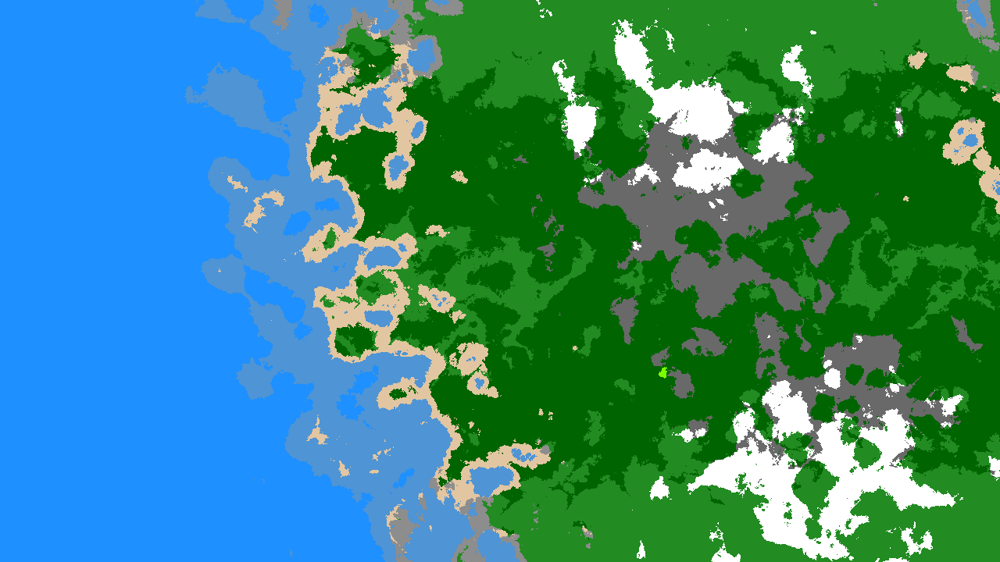

# Générateur/Éditeur de Carte

Ce projet génère des **cartes procédurales** (relief, température, humidité) grâce à du **bruit** (Simplex), avec la possibilité de **modifier** la carte grâce à différents modes d’édition :
- **Augmenter / Diminuer** la hauteur, la température ou l’humidité.
- **Pinceau de Bruit** pour ajouter des irrégularités locales.

Le tout est **optimisé** en utilisant un **buffer pixel (ImageData)** afin d’améliorer les performances lors de l’affichage et de la retouche.

## Sommaire

1. [Aperçu](#aperçu)
2. [Fonctionnalités](#fonctionnalités)
3. [Installation](#installation)
4. [Utilisation](#utilisation)
5. [Contrôles & Paramètres](#contrôles--paramètres)
6. [Optimisations](#optimisations)
7. [Exemple d'images](#exemple-dimages)
8. [License](#license)

---

## Aperçu

Ce projet crée une **carte** de taille personnalisable, illustrée dans un `<canvas>`.  
L’utilisateur peut :
- Paramétrer la **seed**, l’**échelle**, les **octaves**, la **persistance**, etc.
- Générer **aléatoirement** tous les paramètres.
- Éditer la carte localement à la souris (peinture).

---

## Fonctionnalités

- **Génération procédurale** via Simplex Noise (avec masquage “continent” et différents sliders).
- **Modes d’édition** :
    - `heightUp`, `heightDown` : Ajuster la hauteur.
    - `tempUp`, `tempDown` : Ajuster la température.
    - `wetUp`, `wetDown` : Ajuster l’humidité.
    - `noiseBrush` : Appliquer un bruit local (pour casser la monotonie et éviter les zones trop lisses).
- **Affichage du pinceau** : un cercle rouge suit la souris, indiquant la zone de retouche.
- **Optimisation** : utilisation d’un `ImageData` global pour un rendu rapide (et non un `fillRect` pixel par pixel).

---

## Installation

1. **Cloner** le dépôt ou téléchargez le code source.
   ```bash
   git clone https://github.com/votre-utilisateur/votre-projet.git
   cd votre-projet
   ```
2. Ouvrez le fichier **index.html** dans votre navigateur.

> **Note** : Aucune dépendance supplémentaire n’est requise hormis [Simplex-Noise.js](https://www.npmjs.com/package/simplex-noise) déjà chargée via un CDN dans le `<head>`.

---

## Utilisation

1. Ouvrez **index.html** dans un navigateur moderne (Chrome, Firefox, etc.).
2. Ajustez les **paramètres** dans la section “Contrôles de génération” :
    - **Seed** (chaîne de texte)
    - **Échelle (Zoom)**, **Octaves**, **Persistance**, etc.
    - **Bouton "Générer"** : génère la carte avec ces paramètres.
    - **Bouton "Générer aléatoirement"** : modifie tous les sliders et la seed de façon aléatoire, puis génère la carte.
3. **Éditez** la carte dans la section “Contrôles d’édition” :
    - Sélectionnez un **Mode d’édition** (hauteur, température, humidité, bruit).
    - Ajustez le **rayon** du pinceau, l’**intensité**, et l’**échelle du bruit** (si `noiseBrush` est choisi).
    - **Cliquez** et **faites glisser** la souris sur la carte pour modifier localement la carte.
4. Vous verrez le **cercle rouge** qui indique la zone d’influence du pinceau en temps réel.

---

## Contrôles & Paramètres

### Paramètres de génération

| Paramètre           | Description                                                                     |
|---------------------|---------------------------------------------------------------------------------|
| **Seed**           | Chaîne de texte pour initialiser le bruit. |
| **Échelle (Zoom)** | Divise les coordonnées pour le bruit (plus la valeur est petite, plus le relief est “large”). |
| **Octaves**        | Nombre de passes dans le bruit fractal. Plus c’est élevé, plus le relief est détaillé (mais plus lent). |
| **Persistance**    | Diminution de l’amplitude à chaque octave (ex. 0.5) |
| **Continents**     | Nombre de **centres** qui vont influencer la forme continentale. |
| **Force du masque**| Contrôle la transition entre continent et océan. |
| **Densité Continent** | Rehausse la hauteur dans les zones continentales (pour éviter les trous). |
| **Taille Continents**| Échelle du masque radial (1..100). |
| **Contour Scale**  | Échelle du **shapeNoise** qui déforme la forme des continents. |
| **Contour Intens.**| Intensité de la déformation. |
| **Warp Amplitude** | Force de “torsion” supplémentaire via `warpNoiseX/Y`. |
| **Ridged Factor**  | Rendra le bruit plus “cassant” (0 = normal, 1 = ridged max). |

### Paramètres d’édition

| Paramètre              | Description                                                                     |
|------------------------|---------------------------------------------------------------------------------|
| **Mode d’édition**     | Choix du type de modification (hauteur, température, humidité, bruit).          |
| **Rayon du pinceau**   | Taille du pinceau en pixels (1..50).                                            |
| **Intensité**          | Amplitude de la modification.                                                   |
| **Échelle du bruit**   | Pour `noiseBrush` : définit la taille des motifs du bruit local.                |

---

## Optimisations

- **ImageData** : On utilise un seul `ImageData` pour la carte, mis à jour localement (pixel par pixel) lors de l’édition. Cela évite d’appeler `fillRect` ou `ctx.drawImage` en boucle.
- **Édition partielle** : Seuls les pixels touchés par le pinceau sont recalculés et mis à jour.
- **Moins d’appels** à `putImageData` : un seul appel après l’édition du pinceau.
- **Pas de bibliothèque lourde** : tout est en JavaScript vanilla, hormis *Simplex-Noise*.

---

## Exemple d’images

1. **Génération de carte** :

   
   
   (vidéo en temps réel)

2. **Édition de carte** :

   

---

## License

Ce projet est mis à disposition sous [MIT License](LICENSE). Vous êtes libre de l’utiliser, de le modifier et de le distribuer.

> **Note** : Veillez à respecter la licence de la bibliothèque **Simplex-Noise** que vous utilisez (elle est également sous licence MIT).

---

**Merci** d’avoir consulté ce projet ! N’hésitez pas à **soumettre des Pull Requests** ou à **ouvrir des issues** si vous avez des idées d’améliorations ou des problèmes à signaler. Bon codage !
